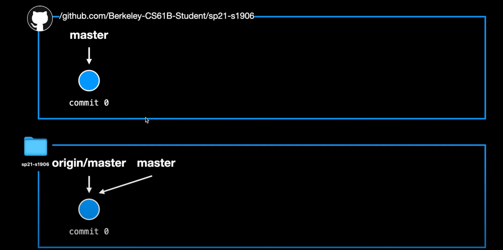

#! https://zhuanlan.zhihu.com/p/582727985
# 4 git and debugging

## git的基础操作。
为什么学git？从git官方手册中讲：
> 什么是“版本控制”？我为什么要关心它呢？ 版本控制是一种记录一个或若干文件内容变化，以便将来查阅特定版本修订情况的系统
如果你是位图形或网页设计师，可能会需要保存某一幅图片或页面布局文件的所有修订版本（这或许是你非常渴望拥有的功能），采用版本控制系统（VCS）是个明智的选择。 有了它你就可以将选定的文件回溯到之前的状态，甚至将整个项目都回退到过去某个时间点的状态，你可以比较文件的变化细节，查出最后是谁修改了哪个地方，从而找出导致怪异问题出现的原因，又是谁在何时报告了某个功能缺陷等等。 使用版本控制系统通常还意味着，就算你乱来一气把整个项目中的文件改的改删的删，你也照样可以轻松恢复到原先的样子。 但额外增加的工作量却微乎其微。

我觉得可以想象git是一个计算机后一个巨型的秩序。
``` 
git init
```
让本地的所在的文件夹建立一个巨型秩序。（有点中二哈哈哈哈哈）
``` 
git add * 
```
把文件中的所有modified文档提到staged area。（星号就是cd所在位置的文件夹中所有的文档。）可以想象有一个git有一张监测网，add就是把文档放到检测网里。
``` 
git commit
```
这张“检测网”给所有网中的文档拍了照片储存。这个秩序的记性很好能记住很多记录。


同时监测网可以有很多branch，master是其中一个branch。可以想象这个masterpointer 永远point在它最新的commit上。同时HEAD永远在current commit上。也就是说每次生成信新的commit之后HEAD和masterpointer都会advance到新的commit上。

一次Commit的记录可以有很多信息，包括date，修改作者等等。
```
git status
```
这个巨型秩序翻阅了最近的记录，也就是HEAD所在的commit的地方。那它的信息跟现在repo的信息比较，查看是否有有改变。

```
git log
```
显出所有记录, 也就是监视网拍的所有照片。

```
git checkout <记录代码> // 就是用log里的   
git checkout master
git checkout <记录代码> -- proj0 // 仅仅把proj0的文件里的内容还原成那个版本但是不改变HEAD的指针方向。但是这个action需要重新commit。
```
让本地的repo回到记录代码所在的版本。（是改变文件的方式）。


``` 
git clone <web>
```
有些repo存活在遥远的web上，如果你克隆下来，那么就会多出两个pointer, 一个是origin/master 话有一个origin/HEAD。同时这个origin master在上面的mentalmodel 上显示master指着



``` 
git push origin master
```
这个之后，所有本地的commit都会被推送到origin master上，同时在github上的库的master也会指向最新的commit。前提是：你要commit。（雾


可以用以下命令来看，remote branch的更新情况。
``` 
git remote -v 
```

因为自身的commit和origin master的commit不一样，导致push的时候会被拒绝，因此需要首先执行remote pull origin master。这条命令自动比较commit1（在github）上的，和commit2 然后进行自动merge，同时这个merge过的新版本会是一个新的commit。同时master一样会自动更新到最前面。如果内容冲突，在进行新的pull request的时候会有merge conflict，这时候玩家修改后需要继续手动commit。```git commit -m "merge conflict resolved."```.

**Example**。

skeleton在pull的时候会看是不是和github的repo是否一致。因此若要改变原来自己什么delete掉什么东西的错误的时候，用checkout会比较好。

这个lab到这里就不了了之了，因为它实在是。。我们online users用的是学期末的repo，所以merge conflict的机会都没有捏。LAB5 PEER REVIEW 也直接跳过。

不管了，先往后学吧:P
